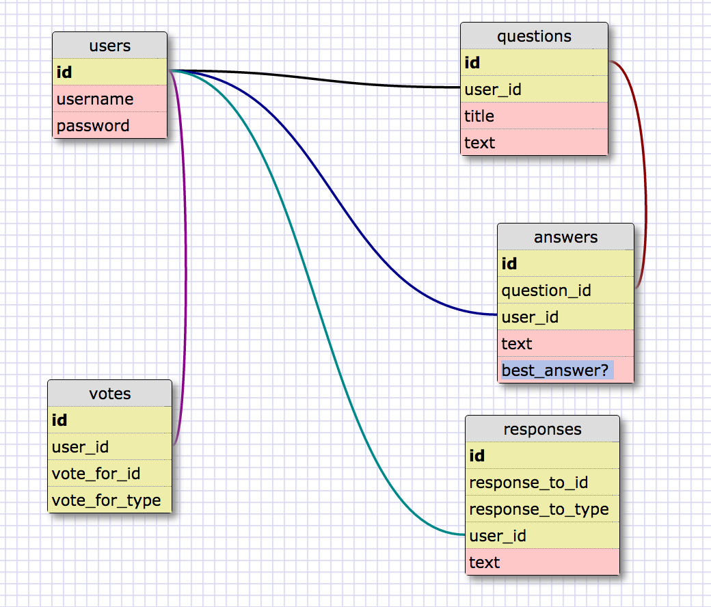

# Team-Plaid-Rhino
DBC Overflow Group Project

Polymorphisms:
Votes -->
Questions, Answers, Responses

Responses -->
Questions, Answers

##get '/questions'
Home page with register and login/link
Contains all questions
option to create new question if logged in

##get '/users/new'
Register page
Username and password ONLY

##get '/questions/:id'
Question page

Displays question
Display response to questions
Button to respond to question (if logged in)

Display answers
Displays responses to answers
button to respond to answer (if logged in)

Displays votes on questions, answers, responses
Button to vote on questions, answers, responses (if logged in)

 ICEBOX - button to respond to responses
 FREEZING ICEBOX - button to vote and comment on votes (only for super admin)

##get '/questions/new'
textarea for title
textarea for question

##get '/sessions/new'
login page

Username/password
